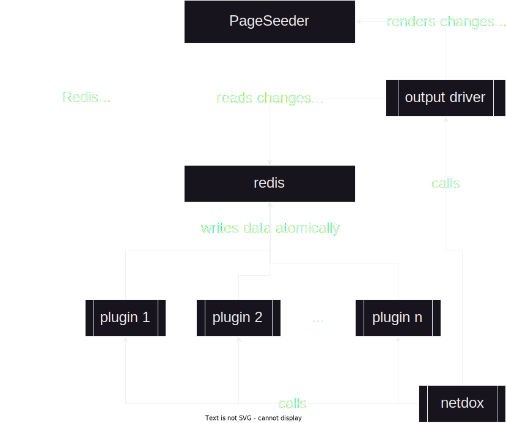

# Architecture
Redis server starts from a dump.
Plugins then run, and create or modify the data types below using custom commands. If a change occurs during one of these commands a message is pushed to the change log.
Once the plugins finish running the display hooks are triggered.
Display hooks render the changes on the remote in any way they see fit.

# Implementation Overview

## Network Address Translation

Previously, netdox has ignored the concept of separate networks.
All addresses are considered local to "*the*" network.
In the new version, this will change. All DNS names must be qualified by a network ID,
in order to allow netdox to model separate networks. This includes virtual networks
like those constructed by Kubernetes.

## IDs

The new version of netdox will use a plugin provided string as the linkable ID for a node.
Plugins other than the one that manages the node cannot predict this "link ID", so providing data to a node must use other methods for matching.
When adding data to a node, plugins must provide two additional pieces of information:
+ The DNS names that the plugin believes resolve to the desired node 
+ Whether those names are "exclusive"

If a plugin provides some information about a node, but does not manage said node, the plugin simply includes any relevant DNS names it knows about. It may be that this plugin has provided a unique set of DNS names to identify the node — in this case, it has essentially created a *soft node*; it cannot be used on its own as it lacks a link ID, so it must be merged with another node which has one. 

When the data is finished updating, all other DNS names that resolve to those provided initially by the plugin are added to a "superset" of DNS names. This superset is used for merging information about the same node, provided by different plugins — all nodes which fall under the same superset are merged.

This model works for the most part. However, it is not rare for one node to act as a proxy or ingress for other nodes. In this situation, all DNS names resolve to the proxy node, and further forwarding is done at an application level - potentially unbeknownst to netdox.

The superset logic above would then merge the proxy node with all of the other nodes that it forwards to, as both the proxy and the destination node would claim one or more of the DNS names in the superset.

To handle this, plugins may provide a boolean value for the *exclusivity* of the node's DNS names. A plugin which is simply providing additional information about a node, like the status of its SSL certificate for example, should set this boolean value to false - the plugin cannot say for certain that **only** the DNS names it knows about resolve to the node.

On the other hand, a plugin that provides information about Kubernetes pods for example, knows that **only** the domains that the Kubernetes configuration specifies will resolve to the pod.
This node can then be merged with *soft nodes* that are identified by a subset of the exclusive DNS names.

In order for this method to succeed, merging must be done according to something similar to  the *longest prefix matching* used by switches. Soft nodes merge with the *linkable node* (node with a link ID) that has the smallest matching DNS superset.

## Redis Commands
All commands create a change log message if they make a change, and all commands take a plugin name argument.

+ ### Create DNS record
	+ Takes the following arguments:
		+ Record name
		+ Record type
		+ Record value
        + Plugin name
+ ### Create node
	+ Takes the following arguments:
		+ Set of DNS names
		+ DNS names exclusive? boolean
        + Plugin name
+ ### Create plugin data
	+ Takes the following arguments:
		+ Identity
        + Plugin name 
        + Data type (map, array, string)
        + Data fragment title
		+ Some plugin data
+ ### Create metadata
    + Takes the following arguments:
        + Identity
        + Key
        + Value
        + Plugin name
        
## Redis Keys
+ ### changelog  -  Stream
	+ Contains all changes made to the dataset.
	+ #### Entries
		+ ##### create dns name
			+ `${dns_name}`
		+ ##### create dns record
			+ `${record_name} --(${record_type})-> ${record_value}`
		+ ##### create node with names
			+ `${dns_name_1}, ${dns_name_2}, ...`
		+ ##### plugin updated node name
			+ `(${node_id}) ${old_name} ---> ${new_name}`
		+ ##### plugin updated node exclusivity
			+ `(${node_id}) ${old_exc} ---> ${new_exc}`
        + ##### updated metadata
            + `(${id}) ${key}: ${old_val} ---> ${new_val}`
   
+ ### meta;\${id}  -  Hash
    + Contains metadata about the object
   
+ ### dns  -  Set
	+ Contains all dns names.
+ ### dns;\${dns_name};plugins  -  Set
	+ Contains all plugins that reference **\${dns_name}**.
+ ### dns;\${dns_name};\${plugin_name}  -  Set
	+ Contains all types of records provided by **${plugin_name}** that reference **\${dns_name}**.
+ ### dns;\${dns_name};\${plugin_name};\${record_type}  -  Set
	+ Contains the dns record **values** for all dns records with name **\${dns_name}**, of type **\${record_type}** provided by **\${plugin_name}**. 

+ ### nodes  -  Set
	+ Contains all node ids.
+ ### nodes;\${node_id};plugins  -  Set
	+ Contains all plugins that provde a node at **\${node_id}**.
+ ### nodes;\${node_id};\${plugin_name}  -  Hash
	+ Contains details of a node as provided by the plugin **\${plugin_name}**.
	+ #### Entries
		+ ##### name
			+ Plugin name
		+ ##### exclusive
			+ Whether to merge this node with an equivalent set of dns names.

+ ### plugin data  -  ?

## Other Features
+ ### Notes
	+ Handle in pageseeder??
	+ Could also just be plugin
	+ Alternatively could add core support for pulling specified data from display remote.
+ ### Organizations
	+ Map org names to set of identities
 + ### Locations
	 + Map locations to subnets
 + ### PageSeeder
	 + Output driver
	 + Use python from netdox for now, in future move to lib generated from psml xsd?
 + ### Links
	 + Custom data type within redis
	 + OR special prefix/mangling to indicate link
 + ### Sentencing
	 + If write is not a new change, append to confirmation log?
		 + At the end of plugin run, every data point not confirmed or changed gets marked as stale.

## PageSeeder Atomic Updates
+ Create fragment edit with [PUT URI FRAGMENT](https://dev.pageseeder.com/api/services/uri-fragment-PUT.html)
+ Move fragment to correct section with [MOVE URI FRAGMENT](https://dev.pageseeder.com/api/services/move-uri-fragment-POST.html)
